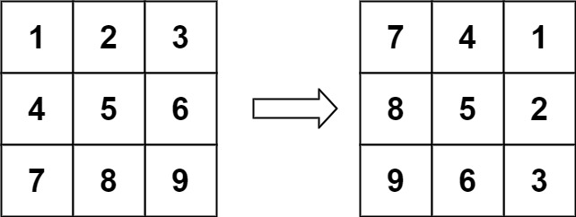

# Rotate Matrix/Image - Leetcode 48

You are given an `n x n` 2D `matrix` representing an image, rotate the image by 90 degrees (clockwise).

You have to rotate the image <b>in-place</b>, which means you have to modify the input 2D matrix directly. <b>DO NOT</b> allocate another 2D matrix and do the rotation.

### Example 1:

    Input: matrix = [[1,2,3],[4,5,6],[7,8,9]]
    
    Output: [[7,4,1],[8,5,2],[9,6,3]]

    Explanation :
    Initially the matrix is : [[1,2,3],[4,5,6],[7,8,9]]
    After rotating the matrix by 90 degrees, the matrix becomes : [[7,4,1],[8,5,2],[9,6,3]]

### Example 2:

    Input: matrix = [[5,1,9,11],[2,4,8,10],[13,3,6,7],[15,14,12,16]]
    
    Output: [[15,13,2,5],[14,3,4,1],[12,6,8,9],[16,7,10,11]]

    Explanation :
    Initially the matrix is : [[5,1,9,11],[2,4,8,10],[13,3,6,7],[15,14,12,16]]
    After rotating the matrix by 90 degrees, the matrix becomes : [[15,13,2,5],[14,3,4,1],[12,6,8,9],[16,7,10,11]]
    
### Constraints:

- n == matrix.length == matrix[i].length
- 1 <= n <= 20
- -1000 <= matrix[i][j] <= 1000

## Your Task:
- You don't have to read input or print anything. Your task is to complete the function rotate() which takes the 2D array matrix[][] and returns the rotated matrix.

### Expected Time Complexity: O(N^2)

### Expected Auxiliary Space: O(1)