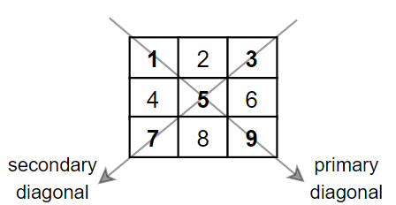

# Matrix Diagonal Sum - Leetcode 1572

Given a square matrix `mat`, return the sum of the matrix diagonals.

Only include the sum of all the elements on the primary diagonal and all the elements on the secondary diagonal that are not part of the primary diagonal.

### Example 1:

    Input:
    mat = [[1,2,3],
           [4,5,6],
           [7,8,9]]
    
    Output: 25

    Explanation :
    Diagonals sum: 1 + 5 + 9 + 3 + 7 = 25
    Notice that element mat[1][1] = 5 is counted only once.

### Example 2:

    Input:
    mat = [[1,1,1,1],
           [1,1,1,1],
           [1,1,1,1],
           [1,1,1,1]]
    
    Output: 8

    Explanation :
    Diagonals sum: 1 + 1 + 1 + 1 + 1 + 1 + 1 + 1 = 8

### Constraints:

- `n == mat.length == mat[i].length`
- `1 <= n <= 100`
- `1 <= mat[i][j] <= 100`

## Your Task:
- You don't have to read input or print anything. Your task is to complete the function diagonalSum() which takes the 2D array arr[] and returns the sum of both diagonal elements.

### Expected Time Complexity: 
O(n), where n is the length of each row in the array.

### Expected Auxiliary Space: O(1)